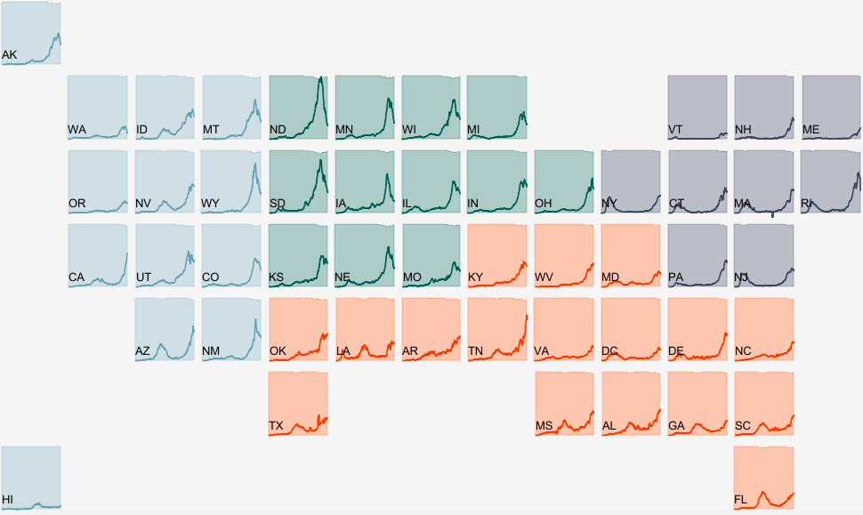

 
I am a data enthusiast and lover of stories and graphics. I currently work as a Data Science Consultant with Deloitte, supporting clients in the federal government. I develop data pipelines, build analytics solutions, and help clients to use their data effectively. 

Prior to Deloitte, I spent the first seven years of my career at [Hanover Research](https://www.hanoverresearch.com/), where I  most recently served as the senior director of data analytics, with a focus on K12 and higher education. Before that, I served as a project and client manager in Hanover's [K12 Education practice](https://www.hanoverresearch.com/k-12-education/), where I managed research and analysis projects for over 50 clients, including state departments of education and some of the largest districts in the country.

I enjoy managing teams, but I also like being close to the action; data analysis is a passion of mine, and it's not just something I do for work. In the last year, for example, I've volunteered with The [COVID Tracking Project](https://covidtracking.com/) as a data analyst and have maintained a daily dashboard on COVID-19 data since May 2020. I work in R primarily but also have significant work experience working in Python and Spark (Databricks and PySpark). I also love making visualizations in Tableau. Check out my work using the tabs above!

 
 
 

