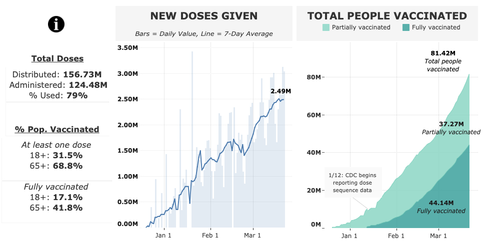

I enjoy creating dashboards on topics that interest me. Most of them are hosted on my [Tableau Public site](https://public.tableau.com/profile/ckelly2528#!/), but you can find them below as well. Sometimes you'll find me highlighting them on Twitter.

### COVID-19 Daily Statistics
This dashboard uses data from the Department of Health and Human Services, and the Centers for Disease Control and Prevention to display trends in COVID-19 cases, deaths, hospitalizations and tests. Click [here](covid_dashboard.html) to view the dashboard. 

 
 
 
 
 
 
 
 
 
 
 
 

### COVID-19 Vaccine Distribution
This dashboard presents data from the [CDC]() on vaccine distribution and administration in the United States, with the aim of tracking the US' ramp-up of vaccination capacity.Click [here](vaccine_dashboard.html) to view the dashboard. 

 
 
 
 
 
 
 
 
 
 
 
 

### Additional COVID-19 analytics

* [Massachusetts COVID-19 Analysis](mass.html)
* [Omicron Variant: South Africa COVID-19 Analytics](south_africa_report.html)
* [CDC Excess Deaths Dashboard](excess_deaths_dashboard.html)

<!-- ### Omicron Variant: South Africa Charts -->
<!-- This page presents data for South Africa to track the trajectory of the Omicron variant. Click [here](south_africa_report.html) to view the site.  -->

<!-- 
<a href="south_africa_report.html"> -->
<!--  -->
<!-- </a>
 -->

<!--   -->
<!--   -->
<!--   -->
<!--   -->
<!--   -->
<!--   -->
<!--   -->
<!--   -->
<!--   -->
<!--   -->
<!--   -->
<!--   -->

### 2020 Election: Presidential Polling Averages
This dashboard used data from [FiveThirtyEight](https://github.com/fivethirtyeight/data/tree/master/polls) to compare presidential polling averages at similar points in the 2016 and 2020 presidential elections. Click [here](polling_dashboard.html) to view the dashboard.
 

 
 
 
 
 
 
 
 
 
 
 
 
 

### 2020 Election: Early Vote Tracker
This dashboard used data from Michael McDonald and the [U.S. Elections Project](https://electproject.github.io/Early-Vote-2020G/index.html), tracking vote-by-mail and early voting trends in the 2020 general election. Michael's site only provided a snapshot of early voting trends, so I cached the daily data to show trends over the course of the full run-up to the election. Click [here](https://public.tableau.com/profile/ckelly2528#!/vizhome/VotebyMailTracker/Dashboard1) to view the dashboard.

 

 
 
 
 
 
 
 
 
 

