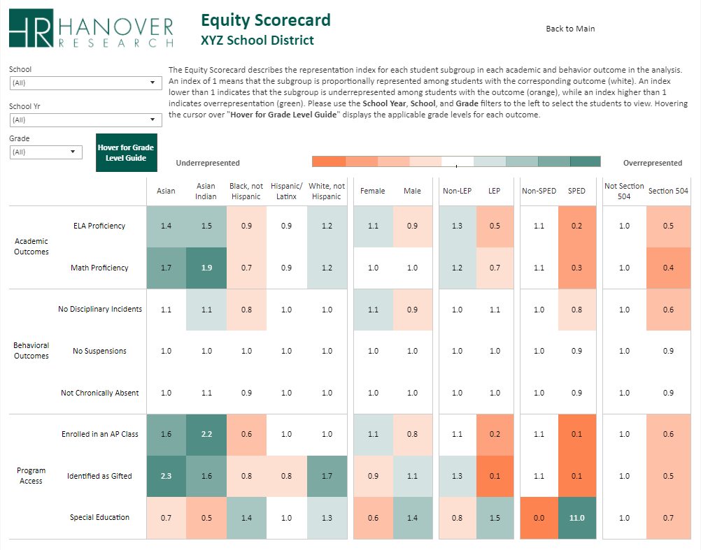
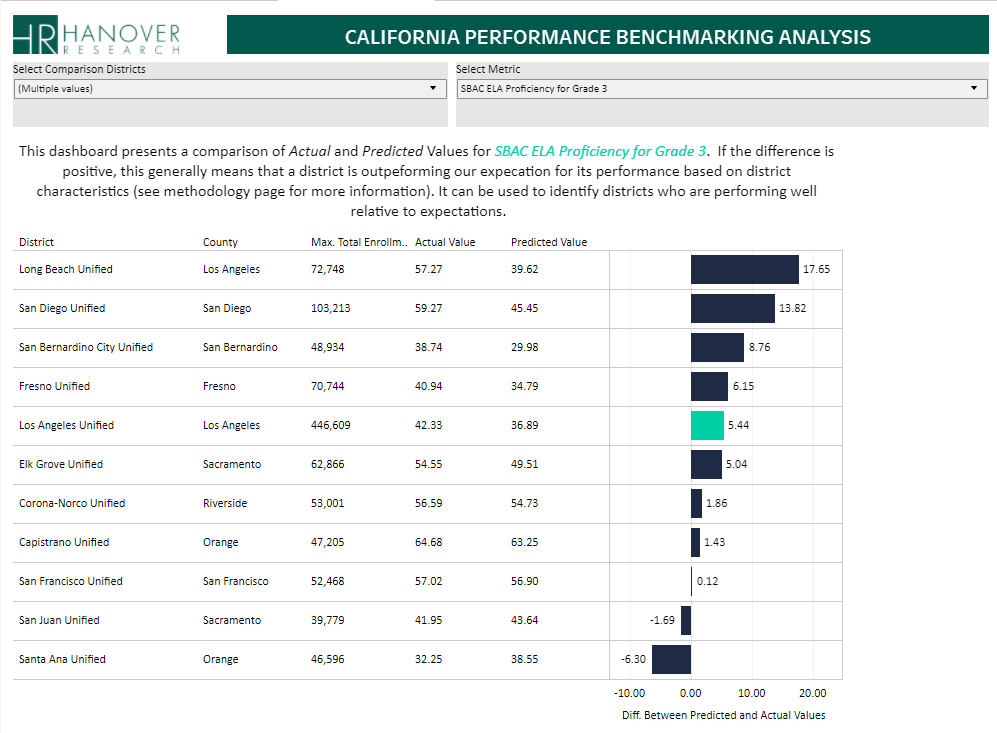
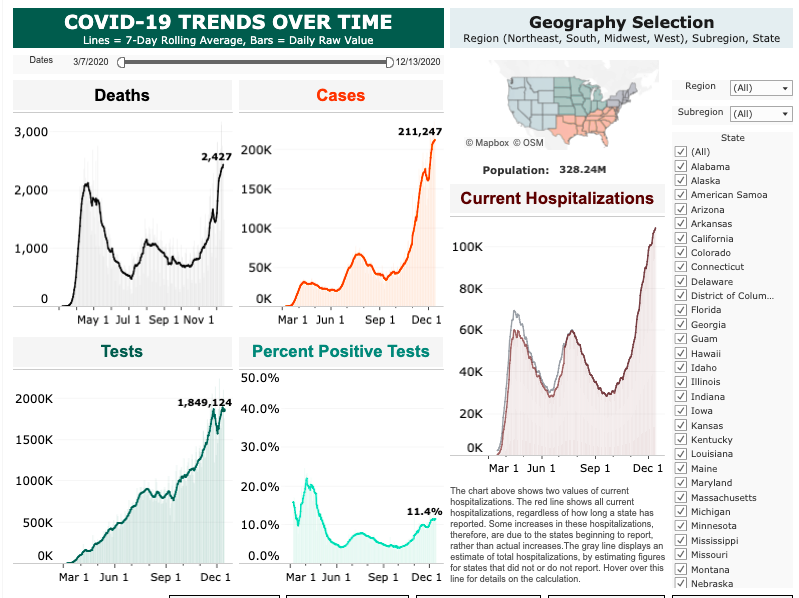
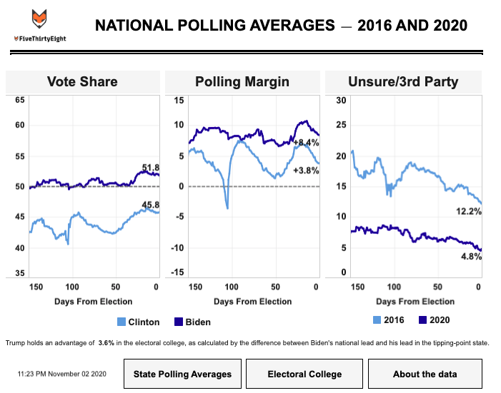

Here's a sample of some of my recent work! 

While I can't link to the code or finished product for any of the projects in my job at Hanover or Deloitte (they are the property of our clients), I think they are pretty interesting and describe them below. I also highlight the code and dashboards for a couple projects (COVID-19 and 2020 elections) that I have pursued on my own time.

-------------------------------------------------

##  Hanover Research 

###  Equity Audit 

Over the last year, I have developed a framework for a quantitative analysis of student outcomes in K-12 school districts through an equity lens. The dashboard displays a wide range of student outcomes (e.g., test scores, behavior, college readiness) and district inputs (e.g., program access, teacher quality) across a series of student groups, displaying representation indexes to standardize analysis. This product has been used by leaders in some of the country's largest school districts to examine equity within their schools and push a data-driven discussion of barriers to opportunity for all students. For a typical project, this involves collecting, wrangling, and combining up to 20 distinct files from student data systems, often involving millions of student records and thousands of lines of `R` code, before visualizing in Tableau. 

 

###  School District Benchmarking 

In early 2020, I created a tool for school districts to benchmark their performance against demographics-adjusted predictions, providing a significant improvement over typical accountability frameworks that emphasize absolute performance and reward districts that serve better-resourced populations. This tool produced district-level predictions for student performance across a range of outcomes that adjusted for the characteristics (e.g., income and education) of the communities that districts serve. The result is that district leaders can see where they are under- and over-performing expectations and adjust focus accordingly. The project involved collecting dozens of data files from state department of education databases, reshaping and combining to the district-level and fitting predictions using STATA, before visualizing in Tableau. 

-------------------------------------------------

##  COVID-19 

I've been focused on COVID-19 data since the beginning of the pandemic. My main project has been maintaining a dashboard that uses daily data from The COVID Tracking Project (public API) and the New York Times (GitHub repo), with over 50 visualizations. To date, it has been viewed over 150,000 times on my Tableau public page.   

Since June, I have been working as a volunteer with The COVID Tracking Project, focusing on data visualization and analysis. I have written blog posts analyzing hospitalizations, testing, and Long-Term Care (LTC) data, and I am the main analyst on the LTC data team. The LTC work has involved extracting and transforming data from the data collection team's Google Sheets using R and creating Tableau visuals which power the LTC page on The COVID Tracking Project website and [numerous analyses](https://covidtracking.com/blog/category/long-term-care) of the impact of COVID-19 on US long-term care facilities.

###  Visualization  `r emo::ji("chart increasing")`

* COVID-19 Tableau [dashboard](covid_dashboard.html)

* The COVID Tracking Project Long-Term Care [landing page](https://covidtracking.com/data/longtermcare)

###  Code  `r fontawesome::fa("r-project", fill = "steelblue")` `r fontawesome::fa("python", fill = "gray")`
* Data wrangling in Python and R for COVID-19 dashboard ([GitHub](https://github.com/ckelly17/Coronavirus-Dashboard)) 
* R scripts to support Long-Term Care projects and blog posts ([GitHub](https://github.com/ckelly17/Covid-Tracking-Project))
* COVID-19 projections ([notebook](projection.html))

###  Writing  `r emo::ji("newspaper")`
*[To Understand the US Pandemic, We Need Hospitalization Data—and We Almost Have It](https://covidtracking.com/blog/hospitalization-data)*

* Blog post written in June 2020 with Whet Moser covering the US states' patchwork approach to publishing data on COVID-19 hospitalizations. The post and one of my visualizations was cited in *The Atlantic*.

*[Something is Wrong with Testing Data in the Great State of Texas](https://covidtracking.com/blog/something-is-wrong-with-testing-data-in-the-great-state-of-texas])* 

* Blog post written in August 2020 with Pat Kelly and Judith Oppenheimer covering Texas' transition to new data systems for tracking COVID-19 testing and calling for greater transparency about the validity of published statistics (primarily test positive rate) used by public officials for reopening decisions.

*[Introducing the Long-Term Care COVID Tracker: Tracing COVID-19’s Dramatic Toll on a Uniquely Vulnerable Population](https://covidtracking.com/blog/long-term-care)*

* Blog post written in September 2020 with Whet Moser introducing The COVID Tracking Project's Long-Term Care dataset. Created visuals based off of the great data collection work of Artis Curiskis and Kara Oehler.

-------------------------------------------------

##  Polling Analysis 

This past fall, I built and maintained a dashboard using data from [538](https://github.com/fivethirtyeight/data/tree/master/polls) to compare presidential polling averages at similar points in the 2016 and 2020 presidential elections, updating when new polls were added to the 538 database. The main goal was visualizing measures other than the margin between candidates (e.g., Biden leads by 6 points) that are often overreported in the media. It is no longer being updated, but I may build something similar in the future.

###  Visualization  `r emo::ji("chart increasing")`

* FiveThirtyEight polling [dashboard](polling_dashboard.html)

###  Code  `r fontawesome::fa("r-project", fill = "steelblue")`
* Data wrangling for polling dashboard ([GitHub](https://github.com/ckelly17/2020-Polling-Averages)) 

